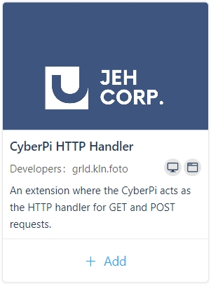

# CyberPi IoT Extension

An extension for HTTP communication with the CyberPi using the python script from mBlock5.
This extension is meant for the CyberPi(ESP32) from Makeblock. It runs on MicroPython using
the basic python libraries (primarily socket and network).

Note : This is the alpha version of the extension. Keep in mind that this build is usable, but
can be considered highly unstable. 

# How to Install
Since this is an mBlock5 extension, please install the software first. Alternatively, you can
use the [Web IDE](https://ide.mblock.cc)

1. Go to the extension section of mBlock 5.

2. Browse down until you see the extension from JEH Corp.

3. Click the add button to add the extension to the canvas.

# Block Description
See the documentation folder for the full documentation and each function of the block.